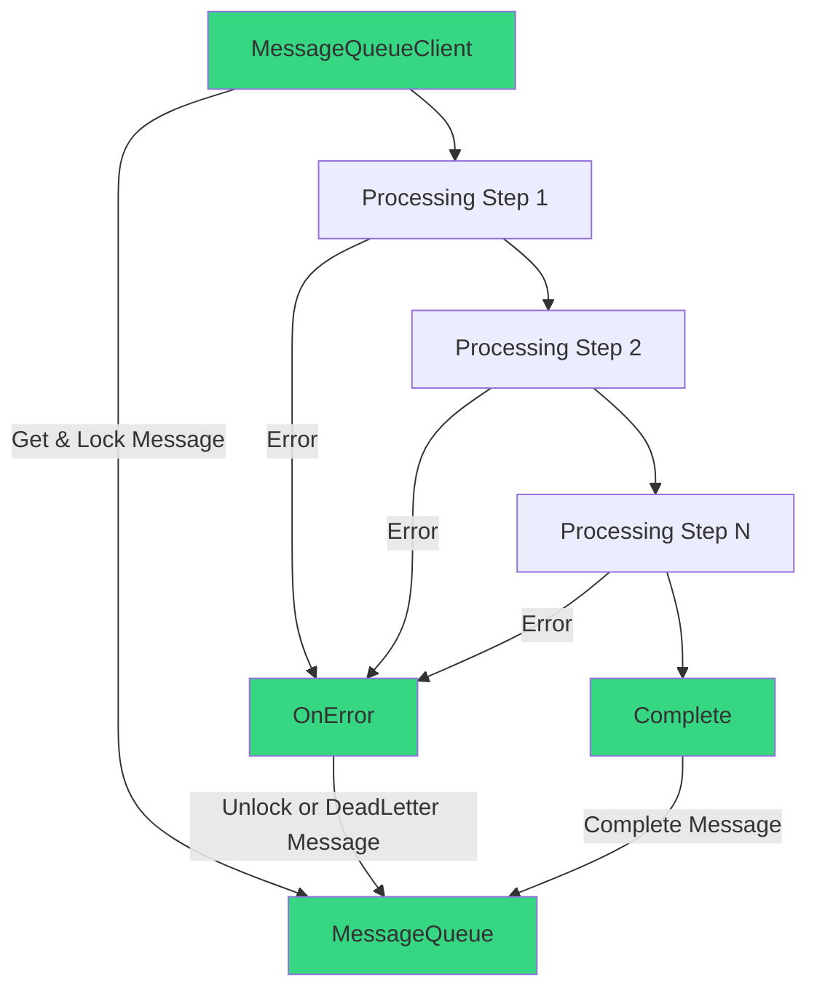
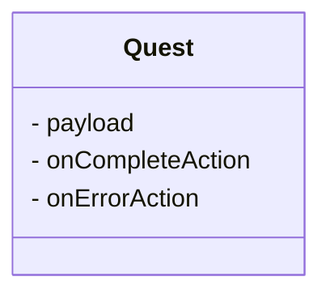

# Quest

An implementation of the Quest Pattern.

The Quest Pattern is a novel design pattern that allows you to define a task with pre-configured completion and error handling mechanisms. This task can be processed by a series of workers, each of which may modify the task's payload or perform actions related to it. When an error occurs, the designated onError action is executed, leveraging logic and dependencies known only to the original task creator. Upon successful completion by all workers, the onComplete action is invoked, enabling the original task creator to handle the task's completion accordingly.

### Installing Quest

You should install [Quest with NuGet](https://www.nuget.org/packages/Quest):

    Install-Package Quest

Or via the .NET Core command line interface:

    dotnet add package Quest

Either commands, from Package Manager Console or .NET Core CLI, will download and install Quest.
Quest is compatible with .NET 4.6.1+, NET Standard, NET Core and all .NET versions above.

### The Quest Pattern

The Quest Pattern was created to address the challenge of processing messages reliably within a distributed system, such as a message queue with multiple clients.

Of course it can be applied to other topics, but this is the most common one.

#### Problem:

Traditional approaches require each message handler and the message receiver to know the specific logic for handling successful message completion and error scenarios on the message queue. This tight coupling leads to:

- **Increased complexity**: Handlers become entangled with queue-specific operations.
- **Reduced flexibility**: Changing queue implementations requires modifications across all handlers.
- **Potential for errors**: Inconsistent error handling can lead to data loss or message duplication.

#### Solution:

The Quest Pattern introduces a wrapper around the message payload. This wrapper encapsulates:

- **Message Data**: The actual message content.
- **OnComplete Action**: A delegate (or callback) for successful message processing. This action is provided by the **MessageReceiver** and specifies how to acknowledge the message to the queue upon successful processing by all handlers.
- **OnError Action**: A delegate (or callback) for handling processing errors. This action is also provided by the **MessageReceiver** and defines the error handling strategy (e.g., unlocking the message for another consumer OR moving it to a dead-letter queue).

#### Key Benefits:

- **Improved Reliability**: Guaranteed message processing through deferred completion and error handling. The message is not acknowledged to the queue until all handlers have successfully processed it, minimizing the risk of data loss.
- **Decoupling**: Handlers focus solely on their core business logic, independent of the underlying message queue implementation.
- **Enhanced Flexibility**: Easily adapt to different message queue implementations by modifying only the message receiver and its OnComplete and OnError actions.
- **Improved Testability**: Handlers can be tested in isolation without the need for a message queue, making testing and debugging more efficient.

#### Workflow:

Marked in **green** are all parts of the system that can handle logic specific to the MessageQueue implementation.

1. **Message Reception**: The message receiver retrieves a message from the queue and initializes the Quest object with the message payload.
2. **Processing Steps**: The message undergoes a series of transformations or actions within each handler.
3. **Error Handling**: If an error occurs at any step, the OnError action is invoked either moving the message to a dead letter queue or unlocking it for retry.
4. **Completion**: Upon successful completion of all processing steps, the OnComplete action is executed, acknowledging the message to the queue.

**Example Implementation**:

By encapsulating the message handling logic within the Quest object, the Quest Pattern promotes a more modular, resilient, and maintainable architecture for message-driven systems.
